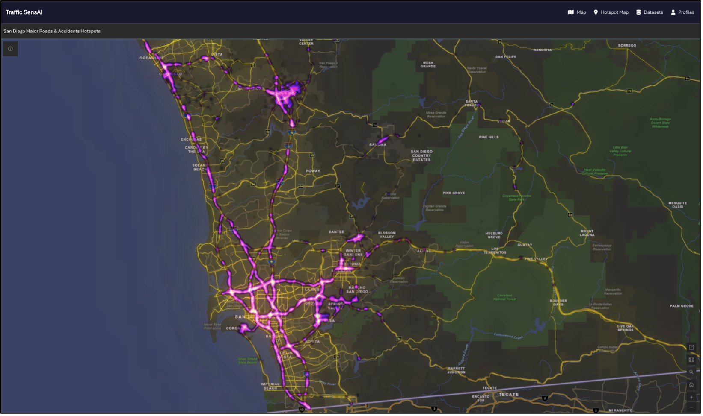
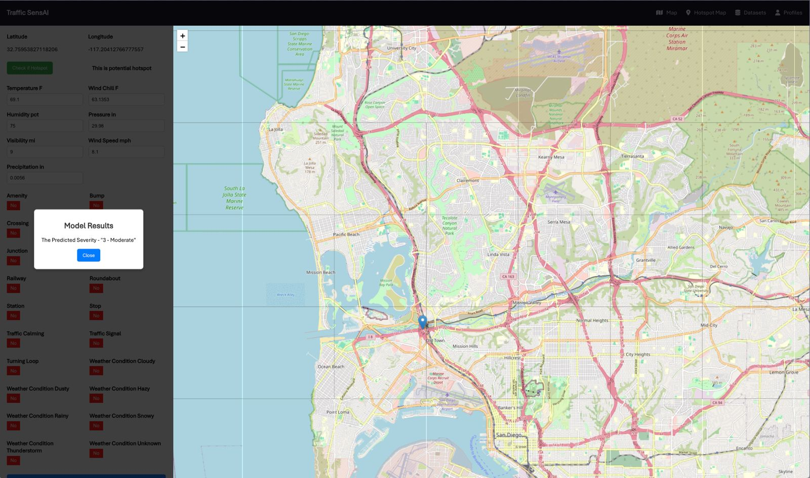

# TrafficSensAI: Predictive Traffic Accident Analysis Tool 🚦

TrafficSensAI is a machine-learning framework for analyzing and predicting traffic collision hotspots. Leveraging datasets from multiple cities in the U.S., this project identifies high-risk traffic zones and contributes to accident prevention and optimized traffic management.

---

## 🌟 Key Features
- **Hotspot Identification:** Uses DBSCAN clustering to detect accident-prone areas.
- **Severity Prediction:** Employs a Random Forest model to predict accident severity based on temporal, environmental, and infrastructure features.
- **Exploratory Analysis:** Unveils insights into accident trends using spatial and temporal visualizations.
- **Granular Risk Ratings:** Classifies accident-prone areas on a risk scale (1-4) for targeted interventions.

---

## 📊 Data Sources
1. [U.S. Accidents Dataset (Kaggle)](https://www.kaggle.com/datasets/sobhanmoosavi/us-accidents)
2. [SWITRS California Highway Patrol Data](https://opendata.sandag.org/Transportation/Safety-Collisions-SWITRS-2023/7mrt-w2uu/data)

---

## 🔍 Methodology
1. **Data Preprocessing:**
   - Filtered California-specific data.
   - Handled missing values and normalized variables.
2. **Feature Engineering:**
   - Extracted temporal and environmental features (e.g., `Time_of_Day`, `Weather_Condition`).
   - Encoded categorical variables for machine learning models.
3. **Clustering (DBSCAN):**
   - Identified accident hotspots using spatial data.
   - Rated clusters by accident density and severity.
4. **Random Forest Model:**
   - Predicted accident severity.
   - Tuned hyperparameters for optimal accuracy.

---

## 📈 Snapshots

### 1. **Geospatial map showing accident hotspots (ArcGIS)**

---

### 2. **Severity Prediction Demo**

---

## 🌐 Applications
1. **Urban Planning:** Design safer roadways and optimize traffic signals.
2. **Traffic Law Enforcement:** Deploy resources during high-risk periods.
3. **Public Awareness Campaigns:** Promote safer driving behaviors in adverse conditions.

---

## 🚀 Future Enhancements
- Incorporate real-time data (e.g., live weather feeds, traffic cameras).
- Expand geospatial analysis with deep learning techniques.
- Develop a dynamic, interactive web-based dashboard.

---

## 🤝 Team Members
<table align="left">
  <tr>
    <th>Name</th>
    <th>Role</th>
  </tr>
  <tr>
    <td>Prajwal Tidke</td>
    <td>Team Lead, Data Analysis, Machine Learning</td>
  </tr>
  <tr>
    <td>Palash Suryawanshi</td>
    <td>Visualization and EDA</td>
  </tr>
  <tr>
    <td>Pranjal Patel</td>
    <td>Data Cleaning and Feature Engineering</td>
  </tr>
  <tr>
    <td>Nikhith Reddy</td>
    <td>Model Validation and Optimization</td>
  </tr>
</table>
